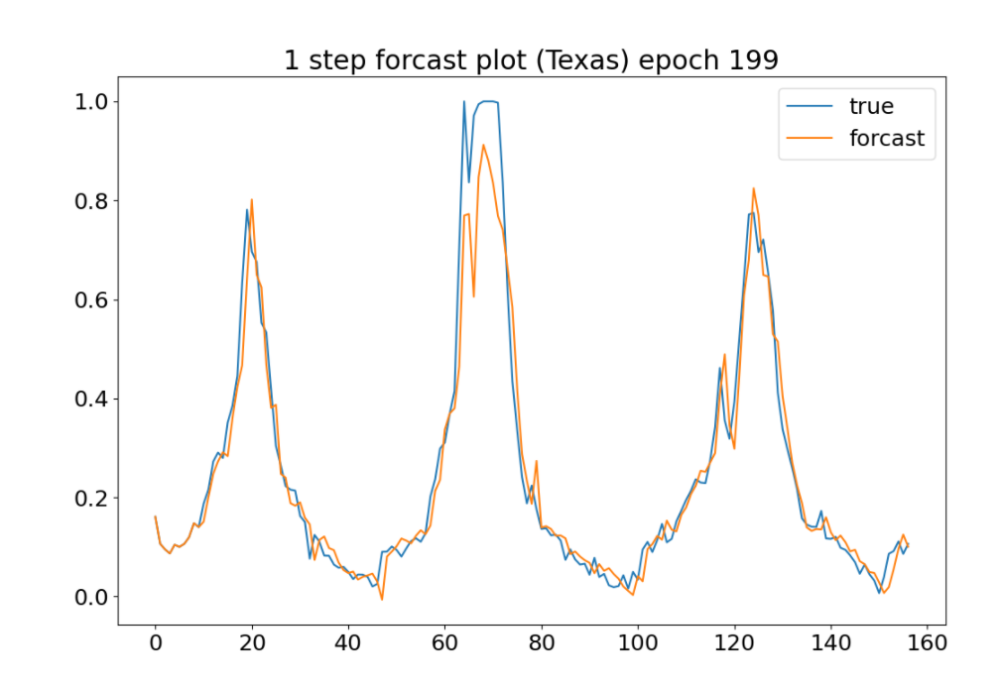

# Deep Transformer Models for Time Series Forecasting: The Influenza Prevalence Case

[日本語はこちら](./README_jp.md)

**None official** implementation of [this paper](https://arxiv.org/abs/2001.08317).

## About paper

- The study deals with a time-series forecasting task using Transformer.
- Experiments were conducted using influenza epidemic data provided by the US CDC.
- Predicted epidemics one week ahead with better accuracy than existing methods such as LSTM, RNN, ARIMA, etc.

## usege

### predict data

1. get state-by-state influenza case count data from the web site of [CDC](https://gis.cdc.gov/grasp/fluview/fluportaldashboard.html)
2. run `bash recipes/set_data.sh path_to_downloaded_data`
3. Data of each state will be as below.

|  | REAGION | YEAR | WEEK | ili_ratio |
| ---- | ---- | ---- | ---- | ---- |
| ... | ... | ... | ... | ... |
| 30 | oregon | 2020 | 32 | 0.5 |
| ... | ... | ... | ... | ... |

### run

#### train with state-by-state data

`bash recipes/run_train_single_state.sh 0 200 0.0001 mse`

See [here](recipes/run_train_single_state.sh) for details.

#### train with all states

`bash recipes/run_train_multi_state.sh 0 1 200 0.0001 mse`

See [here](recipes/run_train_multi_state.sh) for details

## result

One step ahead prediction trained with all states.

## Reference

- [Wu, Neo, et al. "Deep transformer models for time series forecasting: The influenza prevalence case." arXiv preprint arXiv:2001.08317 (2020).](https://arxiv.org/abs/2001.08317)
